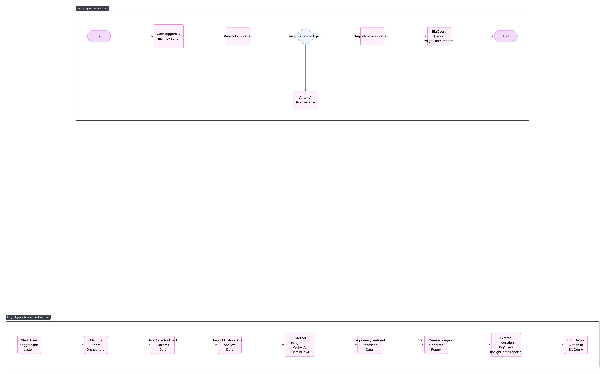

# InsightAgents 🤖📊

InsightAgents is an intelligent agent system built for the [Google ADK Hackathon 2025](https://devpost.com). It helps users gain insights from PDFs, URLs, images, and more using autonomous AI agents powered by Google Cloud.

## 💡 Features
- Accepts PDFs, URLs, images, and screenshots
- Uses Google Cloud Vertex AI and BigQuery
- Orchestrates multiple agents using Google’s ADK
- Answers complex questions from unstructured content

## 🧠 Tech Stack
- Python (ADK)
- Google Cloud (Vertex AI, Cloud Run, BigQuery)
- GitHub + DevPost

## 🚀 How to Run
1. Clone the repo
2. Install dependencies: `pip install -r requirements.txt`
3. Run: `python main.py`

## 📂 Structure
<<<<<<< HEAD

insightagents/
├── agents/
├── utils/
├── main.py
├── .env
└── README.md

## 👥 Team
Built by Abdul Rahman ([@Soulfullmens](https://github.com/Soulfullmens))
=======
insightagents/
│
├── agents/
│   ├── data_collector.py
│   ├── insight_analyzer.py
│   └── report_generator.py
├── main.py
├── requirements.txt
├── .gitignore
├── README.md
└── architecture_diagram.png

## 👥 Team
Built by Abdul Rahman ([@Soulfullmens](https://github.com/Soulfullmens))

🧠 InsightAgents Architecture Diagram
Components:

main.py as orchestrator
>>Three ADK-style agents
Google Cloud services:
Vertex AI (Gemini)
BigQuery

Flow 
                ┌────────────────────────┐
                │    User Runs Pipeline  │
                └────────────┬───────────┘
                             │
                    ┌────────▼─────────┐
                    │ DataCollectorAgent│
                    └────────┬─────────┘
                             │
                    ┌────────▼────────────┐
                    │ InsightAnalyzerAgent│───► Vertex AI (Gemini-Pro)
                    └────────┬────────────┘
                             │
                    ┌────────▼────────────┐
                    │ReportGeneratorAgent │───► BigQuery Table (Reports)
                    └─────────────────────┘

# 🧠 InsightAgents

**Category:** Data Analysis and Insights
**Built With:** Google Cloud ADK, Vertex AI, BigQuery, Python

InsightAgents is a multi-agent system that automates the extraction of meaningful insights from raw business data using AI-powered orchestration. Designed for the Google ADK Hackathon 2025, this project uses multiple AI agents working together to ingest, analyze, and report on data intelligently.

---

## 🧩 Architecture Diagram



---

## 🚀 Features

* 🤖 **Multi-Agent Orchestration** using Google ADK-style design
* 📥 **Data Ingestion** from structured or mock data
* 🧠 **Insight Generation** powered by Vertex AI (Gemini model)
* 📊 **Report Generation & Logging** into BigQuery

---

## 🛠 Technologies Used

* Python 3.10
* Vertex AI (Gemini via `google-cloud-aiplatform`)
* BigQuery (via `google-cloud-bigquery`)
* Google Cloud CLI + Service Accounts
* ADK-style modular agent design

---

## 🧪 How to Run

### 1. Clone and Install

```bash
git clone https://github.com/Soulfullmens/insightagents.git
cd insightagents
python -m venv venv
source venv/bin/activate  # On Windows: venv\Scripts\activate
pip install -r requirements.txt
```

### 2. Set Environment Variables

Create a `.env` file:

```env
GOOGLE_CLOUD_PROJECT=robust-atrium-460918-b1
LOCATION=us-central1
```

Export the service account path (or use `gcloud auth application-default login`).

### 3. Run the Main Pipeline

```bash
python main.py
```

---

## 📂 Project Structure

```
insightagents/
├── agents/
│   ├── data_collector.py
│   ├── insight_analyzer.py
│   └── report_generator.py
├── main.py
├── .env.example
├── requirements.txt
├── README.md
└── architecture-diagram.jpg
```

---

## 🎥 Demo Video

[👉 Watch the 3-Minute Demo](https://youtube.com/your-demo-video)

---

## 📊 BigQuery Table (for reference)

* Dataset: `insight_data`
* Table: `reports`
* Schema:

  * `timestamp` (TIMESTAMP)
  * `report` (STRING)

---

## ✍️ License

MIT

---

## 🙌 Acknowledgements

* Google Cloud ADK Team
* Vertex AI & BigQuery Teams

\#adkhackathon
>>>>>>> old-main
